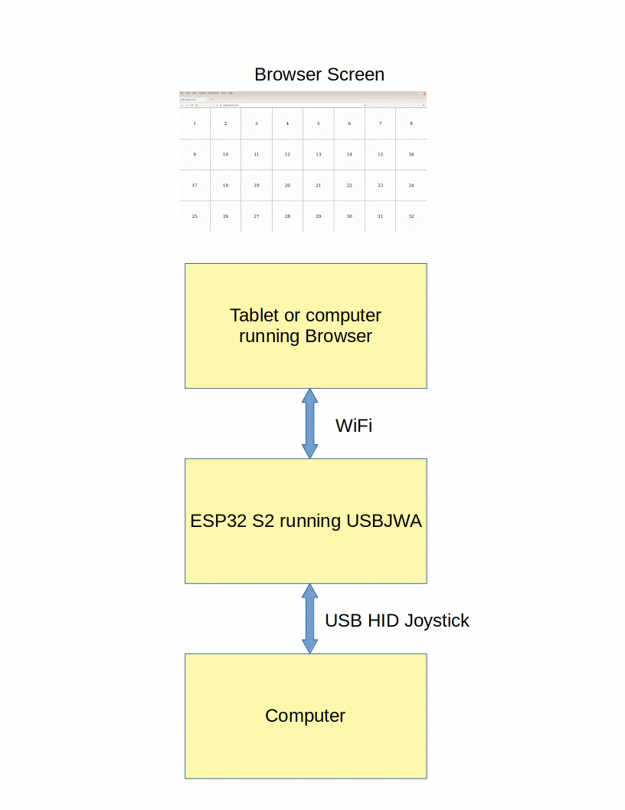
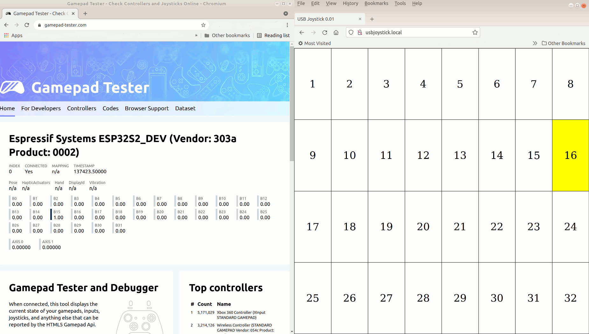
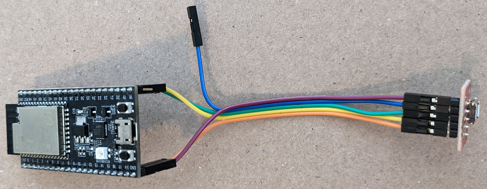

# USBJWA -- USB Joystick Web App

USBJWA (USB Joystick Web App) turns a tablet or any device with a Web
browser into a USB joystick. Anyone having difficulties using a regular
joystick may find a touch joystick easier to use.





The joystick web app displays a 4x8 grid in the browser window. The locations
of touch or mouse events are sent via a web socket back to the ESP32 S2 web
server. The server translates locations to USB HID joystick buttons and sends
them out the USB HID joystick interface.

The ESP32 S2 Saola board is programmed using the Arduino IDE. No soldering is
required. The browser communicates to the ESP32 S2 using WiFi. The ESP32 S2
communicates with the other computer using USB HID.

## Hardware

### USB
This should work on any ESP32 S2 board but has only been tested on the
Espressif Saola and DevKitC boards. Regular ESP32 boards do not have native USB
hardware so will not work.

The ESP32 S2 DevKitC includes a connector for the USB interface as well as the
UART interface. No wires or extra connectors are required.


On the Saola board, the USB micro connector is connected to a CP2102 USB Serial
chip. The USB data is on pin 19 and 20. A separate USB connector or cable must
be connected to pins 19, 20, GND, and 5V. Do not use both connectors at the
same time. If there is no protection diode on the 5V pin, board may be damaged.
Connect to the built-in USB micro connector to program the ESP32 S2. Disconnect
the cable then plug it into the other USB micro connector to test the USB
feature.

ESP32 S2 Saola      |USB micro connector
--------------------|---------------------
GND                 |GND
5V                  |VBUS
19 (USB D-)         |D-
20 (USB D+)         |D+
not connected       |ID

In the following photo, the USB connector is a SparkFun micro USB breakout
board connected to the ESP32 S2 Saola board using Dupont wires.



* [ESP32-S2-Saola-1](https://docs.espressif.com/projects/esp-idf/en/latest/esp32s2/hw-reference/esp32s2/user-guide-saola-1-v1.2.html)
* [ESP32-S2-DevKitC-1](https://docs.espressif.com/projects/esp-idf/en/latest/esp32s2/hw-reference/esp32s2/user-guide-s2-devkitc-1.html)
* [USB Device Driver](https://docs.espressif.com/projects/esp-idf/en/latest/esp32s2/api-reference/peripherals/usb_device.html)

### Joystick Analog Input

#### Saola Board

The ADC1 inputs inputs are reserved for capacitive touch so the joystick X,Y
outputs are connected to ADC2 analog inputs.

|Pin    |Label  |Function           |Joystick
--------|-------|-------------------|--------
|17     |15     |GPIO15, ADC2_CH4   |Xout arduino(A14)
|18     |16     |GPIO16, ADC2_CH5   |Yout arduino(A15)
|19     |17     |GPIO17, INPUT_PULL |Sel
|1      |3V3    |3.3V power         |2.5V (see below for divider)
|42     |GND    |Ground             |GND

https://docs.espressif.com/projects/esp-idf/en/latest/esp32s2/api-reference/peripherals/adc.html

Note: The maximum input value to an analog input pin is 2.5V. A 3.3K Ohm
resistor is used to divide the 3.3 voltage.

```
3.3V
  |
3.3K Ohm resistor
  |
  o-- Joystick VCC
  |
 10K Ohm joystick pot
  |
  Gnd

2.5V(Vout) = 3.3V(Vin) * 10K Ohm / (3.3K + 10K Ohm)
```

## Software

* [Arduino IDE 1.8.16](https://www.arduino.cc/en/software)
* [Arduino ESP32 2.0.0 or newer](https://github.com/espressif/arduino-esp32#esp32-s2-and-esp32-c3-support)

The following libraries can be installed using the IDE Library Manager.

* [WebSockets by Markus Sattler](https://github.com/Links2004/arduinoWebSockets)
* [ArduinoJson by Benoit Blanchon](https://arduinojson.org/)

The following library is installed from github.com and patched for Arduino ESP32
2.0.0.

* [WiFiManager by tzapu/tablatronix](https://github.com/tzapu/WiFiManager)

The patch is required for arduino-esp32 2.0.1.

```
cd <IDE library directory>
git clone https://github.com/tzapu/WiFiManager
cd WiFiManager
git checkout esp32s2
git apply - <<_EOF_
diff --git a/strings_en.h b/strings_en.h
index f28c18d..543792d 100644
--- a/strings_en.h
+++ b/strings_en.h
@@ -371,9 +371,9 @@ const char* const WIFI_MODES[] PROGMEM = { "NULL", "STA", "AP", "STA+AP" };
 //     int8_t                max_tx_power;   /**< This field is used for getting WiFi maximum transmitting power, call esp_wifi_set_max_tx_power to set the maximum transmitting power. */
 //     wifi_country_policy_t policy;  /**< country policy */
 // } wifi_country_t;
-const wifi_country_t WM_COUNTRY_US{"US",1,11,CONFIG_ESP32_PHY_MAX_TX_POWER,WIFI_COUNTRY_POLICY_AUTO};
-const wifi_country_t WM_COUNTRY_CN{"CN",1,13,CONFIG_ESP32_PHY_MAX_TX_POWER,WIFI_COUNTRY_POLICY_AUTO};
-const wifi_country_t WM_COUNTRY_JP{"JP",1,14,CONFIG_ESP32_PHY_MAX_TX_POWER,WIFI_COUNTRY_POLICY_AUTO};
+const wifi_country_t WM_COUNTRY_US{"US",1,11,CONFIG_ESP32_PHY_MAX_WIFI_TX_POWER,WIFI_COUNTRY_POLICY_AUTO};
+const wifi_country_t WM_COUNTRY_CN{"CN",1,13,CONFIG_ESP32_PHY_MAX_WIFI_TX_POWER,WIFI_COUNTRY_POLICY_AUTO};
+const wifi_country_t WM_COUNTRY_JP{"JP",1,14,CONFIG_ESP32_PHY_MAX_WIFI_TX_POWER,WIFI_COUNTRY_POLICY_AUTO};
 #elif defined(ESP8266) && !defined(WM_NOCOUNTRY)
 // typedef struct {
 //     char cc[3];               /**< country code string */
@@ -483,4 +483,4 @@ typedef union {
 } arduino_event_info_t;
 
 */
-#endif
\ No newline at end of file
+#endif

_EOF_
```
